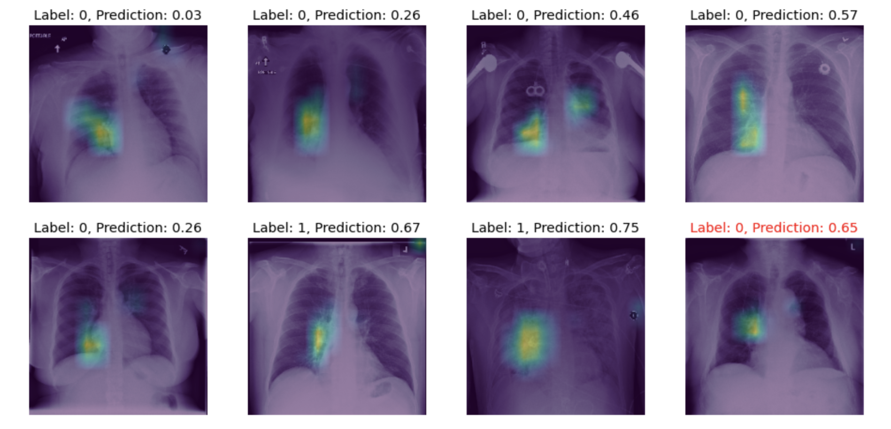

## Pneumonia Detection from Chest X-Ray Images

The notebook presents a Convolutional Neural Network (CNN) classifier that detects pneumonia on x-ray images. It also contains a visualization of representations learned by the network using **activation maps** technique. And finally, it features a visual explanation of the classifier results with **Grad-CAM** (Gradient-weighted Class Activation Mapping). Refer to the **[Overview](#-Overview-of-Data,-Training,-Model-Results)** section for model performance summary. 

<p align=center>

</p>

### Why Detect Pneumonia?

_Pneumonia is a form of acute respiratory infection that is most commonly caused by viruses or bacteria. It can cause mild to life-threatening illness in people of all ages, however it is the single largest infectious cause of death in children worldwide. Pneumonia killed more than 808 000 children under the age of 5 in 2017, accounting for 15% of all deaths of children under 5 years. People at-risk for pneumonia also include adults over the age of 65 and people with preexisting health problems._ [World Health Organization](https://www.who.int/health-topics/pneumonia#tab=tab_1)

_With approximately 2 billion procedures per year, chest X-rays are the most common imaging examination tool used in practice, critical for screening, diagnosis, and management of diseases including pneumonia. However, an estimated two thirds of the global population lacks access to radiology diagnostics._ [Stanford ML Group](
https://www.ncbi.nlm.nih.gov/pmc/articles/PMC7345724/)


### Summary
The CNN is a **VGG model** pre-trained on ImageNet dataset and **fine-tuned** on [NIH Chest X-ray dataset](https://www.nih.gov/news-events/news-releases/nih-clinical-center-provides-one-largest-publicly-available-chest-x-ray-datasets-scientific-community) found on [Kaggle](https://www.kaggle.com/nih-chest-xrays/data). Since the NIH dataset is severely imbalanced (only 1% of all images are classified as pneumonia positive), the **oversampling** of positive class and **undersampling** of negative class were performed prior to training. The final model architecture consists of a VGG architecture, global pooling, fully connected and dropout layers. Adam optimizer was used to improve the binary accuracy, and the final model artifacts were chosen with regard to the best validation loss. 

**Table of Content:**
* Why Detect Pneumonia?
* [**Overview of Data, Training, Model Results**](#-Overview-of-Data,-Training,-Model-Results)
* Load the dataset
* Original Class Distribution
* Data Resampling
    - Training Set
    - Validation and Test Set
* Data Augmentation and Normalization
* Modelling & Training
* Visualization of Learned Patterns
* Visualization of Intermediate Activation Maps
* Training Performance
* Metrics Analysis
    - Precision and Recall
    - ROC/AUC
    - F1-Score
    - Confusion Matrix
    - Final Classification Report
* Visual Interpretation of Model Predictions
* Acknowledgements


### Overview of Data, Training, Model Results

```
Dataset                    :  NIH Chest X-ray Dataset
Training set               :  3720 (oversampled) positive  & 3720 (undersampled) negative images (50/50 ratio)
Validation set             :  250 positive & 1002 (undersampled) negative images (20/80 ratio)
Test set                   :  251 positive & 1002 (undersampled) negative images (20/80 ratio)
Train/Val/Test Split       :  ~75/13/13

Test F1-score              :  0.47
Test AUC                   :  0.58
Test Recall                :  0.55
Test Precision             :  0.41
Test Accuracy              :  0.77
Threshold                  :  0.58

Training Loss              :  0.41
Training Accuracy          :  0.73
Training Precision         :  0.67
Training Recall            :  0.79
Training AUC               :  0.80

Validation Loss            :  0.28
Validation Accuracy        :  0.73
Validation Precision       :  0.68
Validation Recall          :  0.79
Validation AUC             :  0.80
```
